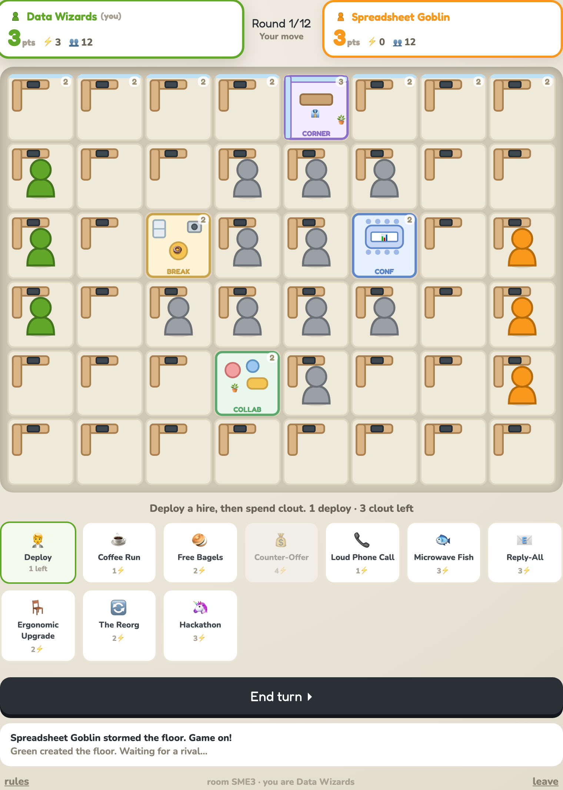

<div align="center">

# Cubicle Coup 🏢

**Two departments. One open floor plan. May the best sneaky tactics win.**

A two-player, turn-based office-territory turf war. Lure neutrals with coffee, poach
rivals with counter-offers, evacuate a wing by microwaving fish, and seize the corner
office. Most desk territory after 12 rounds wins.

[](https://jheasley322.github.io/cubicle_coup/)
&nbsp;
[](https://github.com/jheasley322/cubicle_coup/actions/workflows/deploy.yml)
[](LICENSE)




</div>

---

## Play

**→ [jheasley322.github.io/cubicle_coup](https://jheasley322.github.io/cubicle_coup/)**

1. Name your department and **Create a floor** — you get a 4-letter room code.
2. Send the code to a friend. They open the same link and **Join with code**.
3. The game starts the instant they join. Play from any two devices, anywhere.

No login, no install. Just a code.

## How to play

**Goal** — control the most desk **territory** after 12 rounds.

| Tile | Worth | Where |
|------|:-----:|-------|
| Cube | 1 pt | most desks |
| Window seat | 2 pts | the whole top row |
| Break / Conference / Collab room | 2 pts | the three special rooms |
| **Corner Office** | **3 pts** | top-middle — and the tiebreaker |

The high-value tiles sit in the **contested midfield** on purpose. Turtling in your home
column loses you the game.

**Each turn, in order:**

1. **Deploy** *(free)* — place one new hire from your headcount (👥, 12 to start) onto an
   empty desk that touches your team or your home edge.
2. **Act** — spend **clout** (⚡ +3 each turn, banks up to 6) on as many actions as you
   can afford, then **End turn**.

### Actions

| | Action | Cost | Effect |
|---|--------|:----:|--------|
| ☕ | Coffee Run | 1⚡ | Recruit an adjacent neutral to your team |
| 🥯 | Free Bagels | 2⚡ | Lure an adjacent rival back to neutral |
| 💰 | Counter-Offer | 4⚡ | Poach an adjacent rival outright |
| 📞 | Loud Phone Call | 1⚡ | A worker flees to a nearby empty desk |
| 🐟 | Microwave Fish | 3⚡ | Stink-bomb a desk + its neighbors — everyone evacuates, cells unusable for a round |
| 📧 | Reply-All | 3⚡ | Scatter every worker in a chosen row or column |
| 🪑 | Ergonomic Upgrade | 2⚡ | Fortify one of your desks — can't be flipped or moved |
| 🔄 | The Reorg | 2⚡ | Swap the occupants of two adjacent desks |
| 🦄 | Hackathon | 3⚡ | +2 bonus deploys this turn |

### Power zones

Sit a worker on a room to unlock its power (once per turn):

| Room | Power | Cost | Effect |
|------|-------|:----:|--------|
| ☕ Break Room | Snack Break | free | Convert one adjacent neutral |
| 📊 Conference Room | Mandatory Meeting | 2⚡ | Send every rival in a row/column back to their bench |
| 🛋️ Collab Space | Brainstorm | 1⚡ | Fortify all your workers next to the lounge |

**Winning** — most points after round 12. Ties break on who holds the corner office, then
total headcount, then it's a draw.

## How it works

GitHub Pages serves static files only — it has nowhere to store a game both players can
reach. So the shared state lives in Supabase. Two deploys, two jobs:

```text
   Player A ─┐                         ┌─ Realtime push ─┐
             ├─ HTTPS ─► Edge Function ─► Postgres row ───┤
   Player B ─┘            "game"          (1 per game)    └─► both browsers
                       turn + version
                          guards
```

- **Front-end** — Vite + React, static-built and hosted on **GitHub Pages**. It talks only
  to the Edge Function and holds only the public *publishable* key.
- **Backend** — a single Supabase **Edge Function** (`supabase/functions/game`) implements
  `create / join / read / move / rematch`. Move resolution is client-computed (the engine
  is shared), but the server enforces two guards and nothing about the rules:
  1. **Turn ownership** — a per-side secret token must match the side whose turn it is, so
     you can't move on your opponent's turn.
  2. **Optimistic concurrency** — a write only lands if `version == expectedVersion`, so a
     stale client can't clobber a newer board. On a mismatch the client resyncs.
- **Sync** — clients subscribe to their game row via **Supabase Realtime**, with a ~2s poll
  as a safety net.
- **Security** — the side tokens live in a separate `cubicle_game_secrets` table with no
  client access, so Realtime and REST can never leak them. The real database credential
  never leaves Supabase; the browser's publishable key is gated by RLS.

## Tech stack

| Layer | Choice |
|-------|--------|
| UI | React 18, hand-rolled SVG art, no UI framework |
| Build / host | Vite 5 → GitHub Pages (via GitHub Actions) |
| API | Supabase Edge Function (Deno / TypeScript) |
| Data | Supabase Postgres + Row Level Security |
| Realtime | Supabase Realtime (Postgres changes) |

## Local development

```bash
npm install
cp .env.example .env.local        # fill in VITE_SUPABASE_URL + VITE_SUPABASE_ANON_KEY
npm run dev                       # http://localhost:5173
```

Both env values are safe in the browser — the publishable key is gated by RLS and the
Edge Function; the service-role key never ships to the client. (Set `VITE_BASE=/` if the
`/cubicle_coup/` base path gets in your way locally.)

## Backend

Schema lives in `supabase/migrations/`; the API in `supabase/functions/game/`.

```bash
# Apply the schema (needs a Supabase access token, sbp_...)
#   via the Management API query endpoint, or:  supabase db push

# Deploy the function
SUPABASE_ACCESS_TOKEN=sbp_... npx supabase functions deploy game \
  --project-ref <your-project-ref>

# Smoke-test the live API — create / join / turn-lock / version / stale guards
python3 scripts/smoke_test.py
```

## Deployment

Every push to `main` triggers [`.github/workflows/deploy.yml`](.github/workflows/deploy.yml),
which builds with Vite and publishes `dist/` to GitHub Pages. The build reads
`VITE_SUPABASE_URL` and `VITE_SUPABASE_ANON_KEY` from repository secrets.

## Project structure

```text
index.html                     # Vite entry
src/
  main.jsx                     # React mount
  App.jsx                      # screens, turn flow, targeting, rendering
  engine.js                    # pure game rules — the behavioral source of truth
  constants.js                 # board geometry, actions, palette
  components.jsx               # SVG art, board cell, scoreboard, modals
  net.js                       # the only network module (Edge Function + Realtime)
  config.js                    # build-time env
supabase/
  migrations/                  # cubicle_games + cubicle_game_secrets, RLS, realtime
  functions/game/              # the game API (Edge Function)
scripts/smoke_test.py          # headless API guard test
.github/workflows/deploy.yml   # build + deploy to Pages
docs/                          # screenshots
```

## Roadmap

Deferred from v1 — the game is complete and balanced without them:

- [ ] Deploy-pop and move-tween animations; a richer end-game screen
- [ ] More event-log flavor; an optional sound toggle
- [ ] Scheduled cleanup job for stale game rows
- [ ] Fully server-authoritative engine (client sends *intents*, server resolves) for anti-cheat

## License

[MIT](LICENSE) © 2026 Joe Easley
